# PDD_22_hw
Python: Class-based views (CBV). Mixins. Model Inheritance

## Project
Project name is kvblog.

## Aplication:
Aplication name is 'blogapp'.

## Pages:
Implemented the base page (base.html):

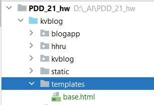

Static is here:

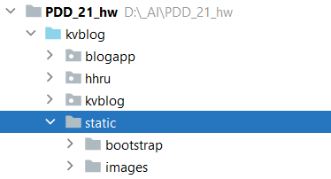

Implemented pages inherited from the base page:

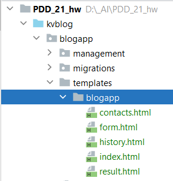

### index.html
index.html - the first page of the aplication;
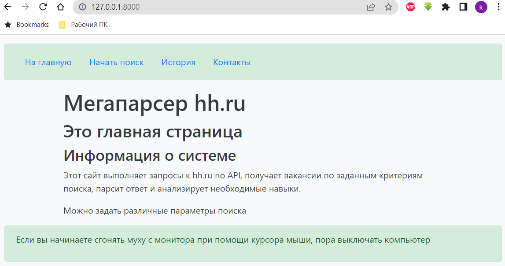

### form.html
form.html - the page with the form used for search at HH.RU;
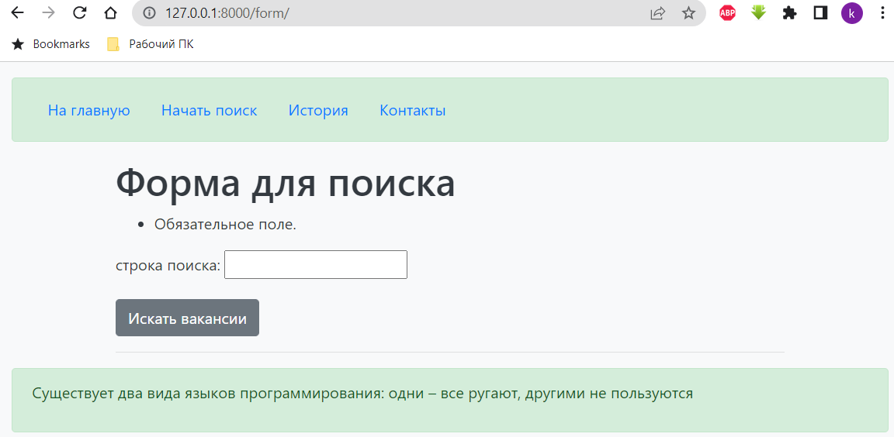

### result.html
result.html - the page with current result of the request at HH.RU;
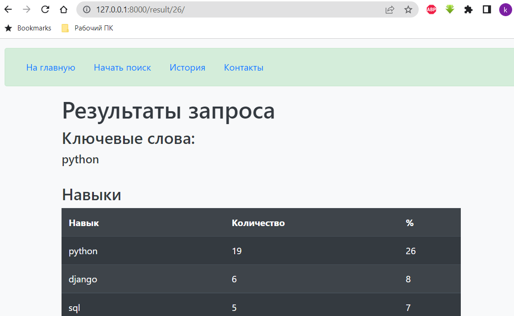

### history.html
history.html - the page with all saved request at the db;
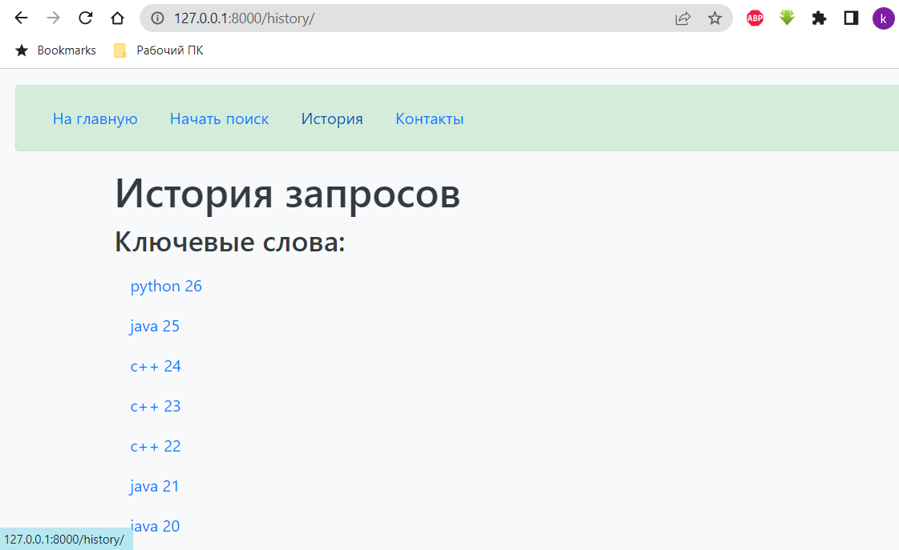

### contacts.html
contacts.html - the page with my contacts.
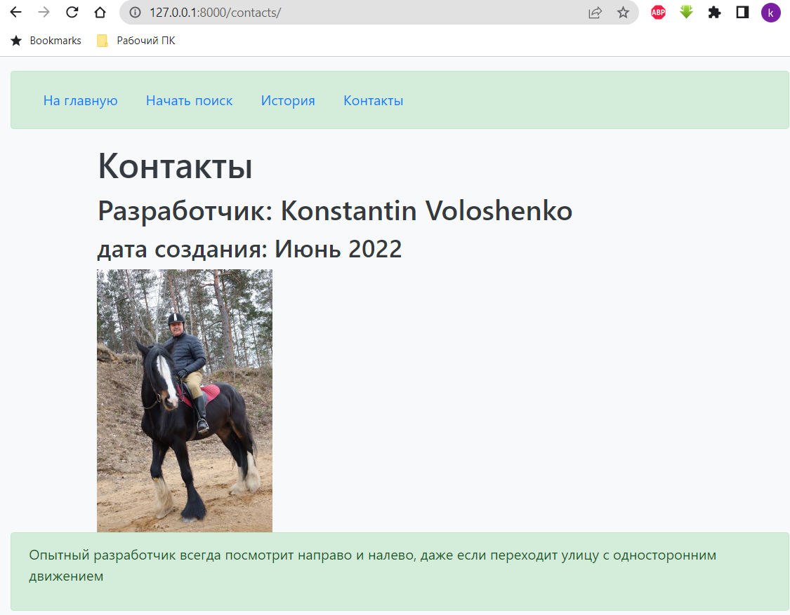

### urls
Internal urls described here:

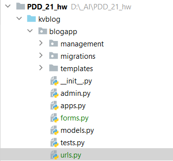

## Models:
Models names are:
* Hh_Request
* Hh_Response

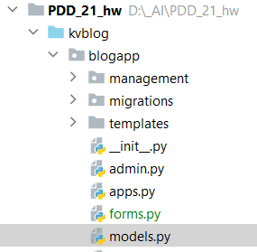

## Django commands:
Implemented two commands:
1. fill_db - to fill database with test data;
2. fill_db_parser - to fill databsse with parsed data from HH.RU

Examples:

python manage.py fill_db

python manage.py fill_db_parser

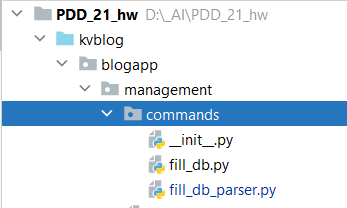